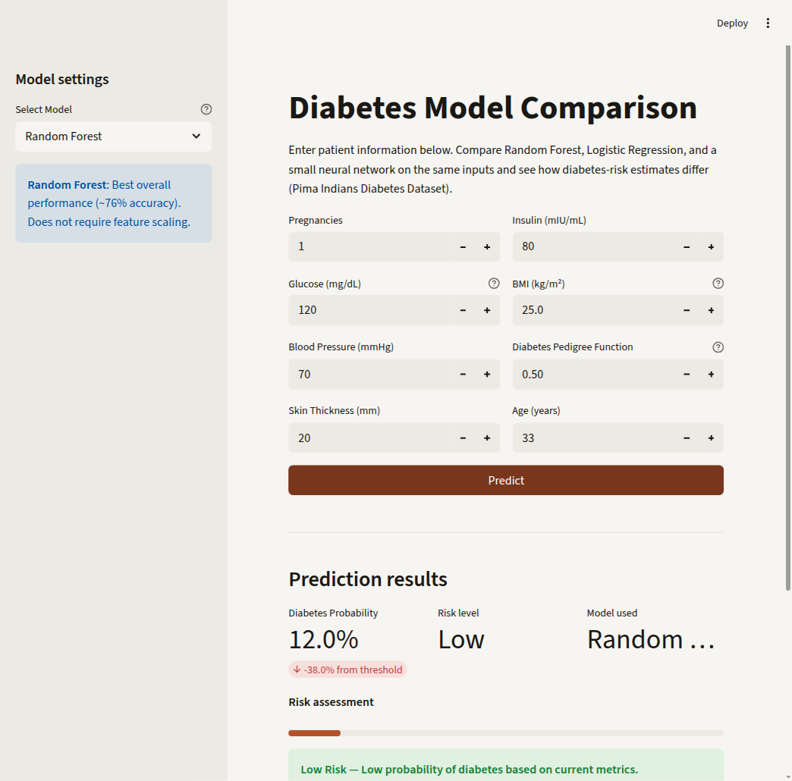

# AI Health Co-op: Diabetes Risk Model Comparison

Compare three models (Random Forest, Logistic Regression, and a small neural net) on the same patient inputs and see how their diabetes-risk estimates differ.



**Related:** Simplest deployable version: [ai-health-predictor](https://github.com/odwamanitshana/ai-health-predictor)

## Features

- **Interactive web UI** — enter eight clinical metrics and run predictions
- **Multi-model comparison** — switch models in the sidebar (Random Forest, Logistic Regression, Neural Network)
- **Metrics and risk tiers** — probability, aligned risk level, progress bar, and tiered guidance
- **Input validation** — checks critical fields before prediction
- **Open source** — trained models and notebook pipeline included

## Models and performance

| Model | Accuracy | Status |
|-------|----------|--------|
| Logistic Regression | ~73% | Baseline |
| Random Forest | **~76%** | Strong default |
| Neural Network | ~76% | Experimental |

Random Forest offers strong accuracy with simpler deployment than the experimental neural network.

## Quick start

### Prerequisites

- Python 3.x (tested on 3.13)
- pip or conda

### Installation

1. **Clone the repository**

   ```bash
   git clone https://github.com/odwamanitshana/ai-health-coop.git
   cd ai-health-coop
   ```

2. **Create a virtual environment**

   ```bash
   python -m venv .venv
   .venv\Scripts\activate  # Windows
   source .venv/bin/activate  # macOS/Linux
   ```

3. **Install dependencies**

   ```bash
   pip install -r requirements.txt
   ```

### Run locally

```bash
streamlit run app.py
```

The app opens at `http://localhost:8501`.

## Usage

1. Choose a model in the sidebar.
2. Enter eight clinical metrics (pregnancies, glucose, blood pressure, skin thickness, insulin, BMI, diabetes pedigree function, age).
3. Click **Predict**.
4. Review probability, risk level, model name, and the medical disclaimer.

## Project structure

```
ai-health-coop/
├── app.py                          # Streamlit comparison app
├── requirements.txt                # Python dependencies
├── README.md                       # This file
├── assets/                         # Favicon and screenshots
├── data/
│   └── diabetes.csv               # Pima Indians Diabetes Dataset
├── models/
│   ├── random_forest.pkl
│   ├── scaler.pkl
│   ├── logistic_regression.pkl
│   └── diabetes_nn.keras
├── notebooks/
│   └── 01_data_preparation.ipynb
├── tests/
│   └── compare_app_notebook.py
└── docs/
    ├── project_reflection.md
    └── PRESENTATION.md
```

## Dataset

**Source:** Pima Indians Diabetes Dataset  
**Samples:** 768  
**Features:** 8 clinical measurements  
**Target:** Binary (diabetes yes/no)

## Deployment

This repository has **no separate live deployment**. For a hosted single-model demo, use the sibling project:

**Single-model version:** [ai-health-predictor](https://github.com/odwamanitshana/ai-health-predictor) (Streamlit Cloud; the free tier may need ~30s to wake on first visit).

To deploy this comparison app yourself: push to GitHub, connect [Streamlit Cloud](https://streamlit.io/cloud), and set `app.py` as the entry file.

## Model comparison test

```bash
python tests/compare_app_notebook.py
```

## Important disclaimer

This tool is for **educational and research purposes only**. It is **not** a substitute for professional medical advice, diagnosis, or treatment.

## Contributing

Fork the repo, create a branch, and open a pull request with a short description of your change. Run `streamlit run app.py` and `python tests/compare_app_notebook.py` before submitting.

## Documentation

- [Project reflection](docs/project_reflection.md)
- [Presentation](docs/PRESENTATION.md)
- [Jupyter notebook](notebooks/01_data_preparation.ipynb)

## Author

Built by [Odwa Manitshana, Software Developer & Automation Engineer](https://github.com/odwamanitshana)

## Support

Open a GitHub issue or review the docs and notebook for implementation details.
